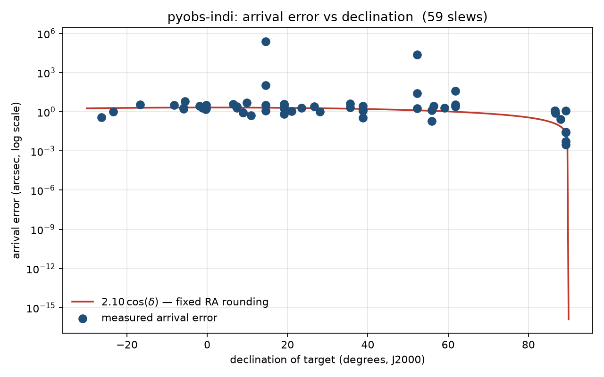

# pyobs-indi

A [pyobs](https://www.pyobs.org/) telescope module for mounts that speak the
[INDI](https://indilib.org/) protocol.

pyobs has modules for professional observatory mounts, and pyobs-alpaca
covers ASCOM hardware on Windows. There was nothing for INDI, which is what
most amateur equipment on Linux uses. I wrote this for my ZWO AM3N and tested
it against indi_simulator_telescope first, then the real mount.

First light was 2026-08-30. The first commanded slew arrived 0.3 arcsec from
target. A 21-slew run that night, from Dec -26 up to +89, landed everything
between 0.3 and 6.3 arcsec, and the long slews clocked the mount at about
5 degrees/sec.

## What it does

Slews by J2000 RA/Dec through the normal pyobs move_radec call. INDI wants
equinox-of-date coordinates with RA in hours, pyobs works in J2000 degrees,
and the conversion happens inside the module. Position is published once a
second so charts and clients can follow the mount.

Arrival is judged by distance, not status. An INDI driver will silently
ignore an out-of-range target: no error, no message, nothing. So if a slew
stops far from where it was sent, the module reports a failure no matter
what the driver's status says.

Park, unpark and abort each wait for the signal that actually means the
operation finished, instead of a timer. Park can be aborted mid-swing. An
aborted slew is reported as aborted, never as an arrival.

The meridian flip is automatic. A ZWO mount never flips on its own: it
tracks a few minutes past the meridian (3.6 minutes on my AM3N, measured),
stops, and then refuses to track until a goto re-acquires the target from
the other side of the pier. Every client that "does meridian flips" is
really just sending that goto at the right moment, which is how NINA and
Ekos do it, so this module does the same. It watches the tracked target's
hour angle and re-slews about 30 seconds after the crossing, while the
firmware is still tracking, so the target is never dropped. The flip only
fires when the pier side shows the mount has not flipped yet, never during
a slew or a park, and a mount you stopped stays stopped. First automatic
flip on the real mount was 2026-08-31: back on target 1.0 arcsec off after
a 34 second swing at Dec +88. Set auto_flip false in the config to turn it
off.

Worth understanding why the firmware is this stubborn: a German mount
tracking past the meridian is slowly winding the telescope into its own
pier, and a mount that keeps obeying track commands will eventually press
the scope into the metal at tracking speed. That is the classic pier
crash, and older worm-drive mounts really will do it. The AM firmware
makes it impossible: it stops tracking past the line, refuses to restart,
and picks a safe pier side on every goto. So the firmware guards the
hardware and this module guards the night; the worst a software failure
can cost on this mount is a stopped mount and a lost target, not bent
metal. A mount without that firmware protection would need those limits
enforced in software before anything here is pointed at it.

Tracking modes (ITrackingMode): sidereal, solar, lunar, and off. Off is the
important one. INDI's abort puts the mount back to whatever it was doing
before the move, which usually means it is still tracking. TRACK_OFF is the
only way to make it actually hold still. Declaring the interface also gets
you pyobs's body tracking (track_body, orbital elements) for free.

Site and time are pushed to the mount on every connect. A rebooted driver
defaults to latitude 0, longitude 0, and on my ZWO the year 2000. I measured
that. A real mount computes every slew from those numbers, so the module
sends them on first connect and again after every reconnect, with longitude
converted to INDI's east-positive convention.

The connection is expected to die and the module deals with it. A driver
that closes the socket politely is noticed right away. A machine that just
vanishes sends no FIN and leaves the socket looking healthy forever, so
there is a silence watchdog for that case. Either way the position cache is
emptied instead of going stale; the module says "unknown" rather than
repeating the last thing it heard. It reconnects on its own, re-requests
every property, and re-sends site and time. Starting the module before the
mount is powered up is also fine, it just waits.

Field note on that last part: the night of first light, macOS decided 1 AM
was a good time for its "Install Tonight" update and quit VS Code, including
the terminal inside it that was running this module, while the mount was
tracking unattended. The mount kept tracking (see the next section). In the
morning the module reconnected, re-sent site and time, and parked the mount
on the first command. Not a test I planned, but I'll take the result.

## What it is not

This is not an interlock. If the software dies, the mount keeps doing
whatever it was last told, and nothing here can stop it. Fast and honest
reporting buys you time to get to a power switch. The real protection is the
mount's own limits and a cutoff you can reach.

## Setup

```yaml
# indi.yaml -- see indi.example.yaml
class: pyobs_indi.IndiTelescope
host: my-indi-server.local     # machine running indiserver
device: ZWO AM5                # INDI device name (an AM3N announces as "ZWO AM5")
port: 7624
```

Run it like any pyobs module:

```
pyobs indi.yaml
```

The site (latitude/longitude/elevation) comes from the standard pyobs
location config and gets forwarded to the mount.

Note for ZWO AM3/AM5 owners: you need INDI 2.x. The 1.9.x driver predates
the AM3 entirely.

## The slew log

Every slew, arrival and refusal is appended to analysis/indi-log.csv. The
epoch conversion is the one part of this module nothing downstream can
check, because a wrong conversion produces a plausible coordinate instead of
an error. So every conversion gets written down and plotted against
declination. The data below includes both the simulator and the real AM3N,
since the conversion under test is the same either way:



The two extreme outliers are aborted slews that an early version of the
module recorded as arrivals; that bug was found in this data, fixed, and is
now covered by tests. The points stay as an honest record.

To be clear about what this measures: it is the difference between the
commanded position and the position the mount reports back. That checks the
software chain and the mount's encoders down to the arcsecond, but it is not
true sky pointing, since the encoders are grading their own work. Pointing
accuracy measured with a camera and plate solving is a separate job for
later.

analysis/plot_log.py regenerates the plot. analysis/indi-log.ipynb is the
same thing as a notebook, plus slew duration against distance.

[RUNBOOK.md](RUNBOOK.md) has the full startup sequence for the whole stack,
one copy-paste block per step.

## Tests

```
python tests/test_epoch.py
python tests/test_reconnect.py
python tests/test_motion_commands.py
python tests/test_site_time_tracking.py
python tests/test_meridian_flip.py
```

Forty tests, none of which need pyobs, INDI or a mount running. The fake
mount in them is deliberately unpleasant: it takes time to move, creeps at
sidereal rate when "still", takes a moment to acknowledge commands, answers
a no-op with a message and no property update, and can accept an order and
silently not move. Every one of those behaviors caused a real bug before it
became a test.

## Status

Working, in use against a ZWO AM3N. Not done yet: alt/az moves, custom
tracking rates, homing. Pier side is read for the meridian flip but not yet
reported through a pyobs interface.

## Related repos

- [pyobs-stellarium-bridge](https://github.com/MichaelJEvan/pyobs-stellarium-bridge):
  puts any pyobs telescope on a Stellarium sky chart.
- [pyobs-sim-container](https://github.com/MichaelJEvan/pyobs-sim-container):
  ejabberd plus a simulated pyobs telescope in Docker; the fastest way to try
  this module with no hardware at all.

## License

MIT. The copyright notice travels with the code, as the license requires.
Beyond that: if this module ends up in your software or your observatory,
a mention and a link back here would be appreciated.
